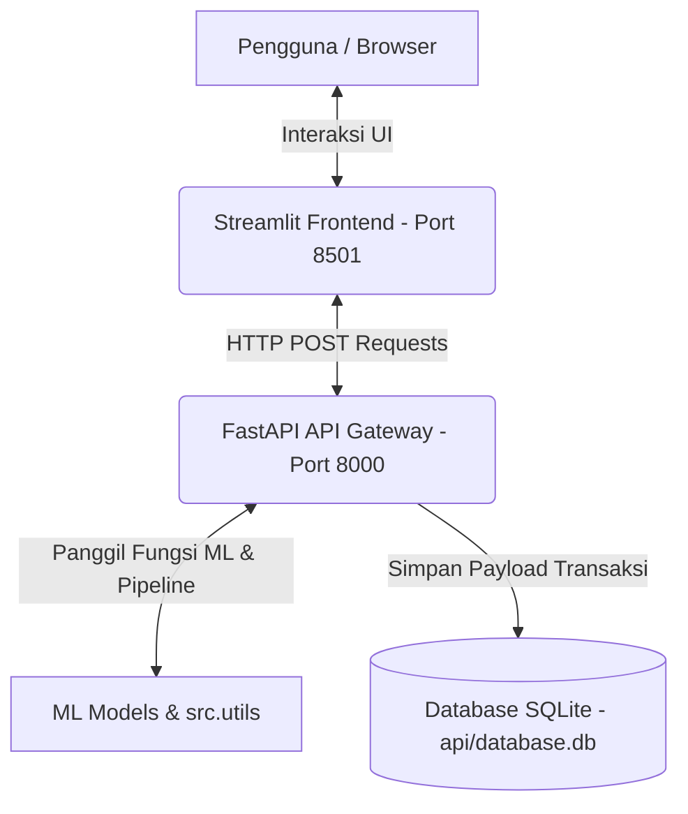

# Sistem Rekomendasi Perbankan Terintegrasi (FastAPI Backend & Streamlit Frontend)

Sistem ini adalah platform rekomendasi perbankan terintegrasi berbasis data transaksi harian dan profil demografis nasabah. Sistem ini menggunakan pendekatan kecerdasan buatan (*machine learning*) dan aturan bisnis (*rule-based*) untuk memberikan rekomendasi produk keuangan (tabungan, pinjaman, dan kartu kredit) secara personal (*hyper-personalization*).

Aplikasi dirancang dengan arsitektur **decoupled (client-server terpisah)**, di mana frontend dibangun dengan **Streamlit** dan backend API dibangun dengan **FastAPI** lengkap dengan pencatatan histori transaksi menggunakan **SQLite**.

---

## 1. Struktur Proyek (Cookiecutter Data Science)

Folder proyek ini diatur menggunakan standar industri **Cookiecutter Data Science** untuk memastikan kerapihan dan kemudahan kolaborasi:

```text
dummy_project/
├── .streamlit/             # Konfigurasi antarmuka Streamlit
├── api/                    # Backend API (FastAPI)
│   ├── main.py             # File utama REST API
│   ├── database.db         # Database SQLite lokal untuk pencatatan log (auto-generated)
│   └── Dockerfile          # Dockerfile untuk container API
├── app/                    # Frontend UI (Streamlit)
│   ├── main.py             # Tampilan interaktif Streamlit
│   └── Dockerfile          # Dockerfile untuk container Streamlit
├── data/                   # Manajemen Dataset
│   ├── raw/                # Dataset mentah dari Kaggle (transactions.csv, customer.csv, dll)
│   └── processed/          # Dataset hasil olahan dan pembersihan (rekomendasi, fitur)
├── models/                 # Bobot model terlatih (.pkl) & konfigurasi kategori
├── notebooks/              # Konsolidasi Jupyter Notebook (.ipynb) untuk riset & EDA
├── src/                    # Modul kode sumber utama proyek (utils.py)
├── deployment_documentation.md  # Dokumentasi teknis deployment sistem
├── docker-compose.yml      # Orchestration Docker untuk API dan Streamlit
├── requirements.txt        # Daftar dependensi library Python
└── README.md               # Dokumentasi utama proyek (file ini)
```

---

## 2. Arsitektur & Alur Data

Aplikasi ini berjalan dengan memisahkan fungsi presentasi (*presentation layer*) dan logika pemrosesan (*application layer*):



### Penjelasan Alur:
1. **Streamlit Frontend ([app/main.py](file:///c:/Users/user/Downloads/dummy_project/app/main.py))**: Mengumpulkan input data nasabah baru maupun nasabah lama, lalu mengirimkannya melalui HTTP POST Request dalam bentuk JSON ke API Backend.
2. **FastAPI Backend ([api/main.py](file:///c:/Users/user/Downloads/dummy_project/api/main.py))**: Memuat model ML, melakukan pembersihan data, menjalankan pipeline kalkulasi rekomendasi pinjaman dan segmentasi kartu kredit, serta mengembalikan hasilnya ke Frontend.
3. **Database Logging ([api/database.db](file:///c:/Users/user/Downloads/dummy_project/api/database.db))**: SQLite mencatat timestamp, endpoint yang diakses, payload input, dan payload output untuk audit model.

---

## 3. Pipeline Pemodelan Machine Learning

Seluruh proses eksperimen dan pembuatan model terdokumentasi dalam folder `notebooks/`:

1. **Preprocessing & Cleaning ([initiate_transaction_data.ipynb](file:///c:/Users/user/Downloads/dummy_project/notebooks/initiate_transaction_data.ipynb))**: Membersihkan data transaksi mentah untuk membangun profil transaksi nasabah.
2. **Rekayasa Fitur ([feature engineer.ipynb](file:///c:/Users/user/Downloads/dummy_project/notebooks/feature%20engineer.ipynb))**: Membuat fitur keuangan kompleks seperti rentang pajak UK, tenure, stabilitas keuangan (koefisien variasi pendapatan/pengeluaran), serta skor prediksi finansial.
3. **Model Klasifikasixgb ([banking_products_category_model_optuna.ipynb](file:///c:/Users/user/Downloads/dummy_project/notebooks/banking_products_category_model_optuna.ipynb))**: Model klasifikasi multilabel XGBoost yang dioptimasi menggunakan **Optuna Hyperparameter Tuning** untuk memprediksi produk perbankan utama yang paling dibutuhkan nasabah.
4. **Mesin Rekomendasi Pinjaman ([loan model.ipynb](file:///c:/Users/user/Downloads/dummy_project/notebooks/loan%20model.ipynb))**: Mesin berbasis aturan (*rule-based*) 3-Level (Precision Spending, Debt-Consolidation, Safe Fallback) dengan suku bunga dinamis berdasarkan profil risiko nasabah (*risk-based pricing*).
5. **Klastering Kartu Kredit ([CreditCardSubtypeRecommendation_Unsupervised.ipynb](file:///c:/Users/user/Downloads/dummy_project/notebooks/CreditCardSubtypeRecommendation_Unsupervised.ipynb))**: Klastering tak diawasi (*unsupervised*) menggunakan **K-Means ($k=7$)** dan **PCA** untuk memetakan nasabah ke subtipe kartu kredit (Fuel, Travel, Grocery, dll.) berdasarkan persentase kategori belanja harian.

---

## 4. Cara Menjalankan Aplikasi

### Metode A: Menjalankan Secara Lokal (Python Environment)

1. **Jalankan FastAPI Backend**:
   Aktifkan virtual environment Anda dan jalankan server uvicorn:
   ```powershell
   .\venv\Scripts\uvicorn.exe api.main:app --host 127.0.0.1 --port 8000 --reload
   ```
   *Swagger API Documentation dapat diakses di: [http://127.0.0.1:8000/docs](http://127.0.0.1:8000/docs)*

2. **Jalankan Streamlit Frontend**:
   Buka terminal baru, aktifkan virtual environment, dan jalankan Streamlit:
   ```powershell
   .\venv\Scripts\streamlit.exe run app/main.py
   ```
   *Frontend interaktif dapat diakses di: [http://localhost:8501](http://localhost:8501)*

### Metode B: Menjalankan Menggunakan Docker (Rekomendasi Produksi)

Gunakan Docker Compose untuk membangun dan menjalankan seluruh container secara otomatis:
```bash
docker-compose up --build
```
* **Frontend Streamlit:** `http://localhost:8501`
* **Backend FastAPI:** `http://localhost:8000`

---

## 5. Nilai Strategis Bisnis (*Business Value*)

* **Optimalisasi Pendapatan Bunga (*Net Interest Margin*):** Penentuan suku bunga pinjaman dinamis berbasis risiko memastikan harga penawaran pinjaman kompetitif bagi nasabah berkualitas tinggi dan aman bagi bank.
* **Meningkatkan Rasio Aktivasi Kartu (*Active Card Rate*):** Dengan mencocokkan subtipe kartu kredit dengan kategori pengeluaran riil terbesar nasabah (misal: kartu Grocery untuk pembelanja groceries bulanan), nasabah akan langsung menggunakan kartu kredit secara aktif.
* **Mitigasi Rasio Kredit Macet (*NPL Mitigation*):** Profil risiko terintegrasi membantu mendeteksi kelayakan pinjaman nasabah secara instan sebelum penawaran diberikan.

**LINK**
STREAMLIT : https://recommendationbankingappuct-jbtk.streamlit.app/